# Estimating age and age class of harvested hog deer from eye lens mass using frequentist and Bayesian methods

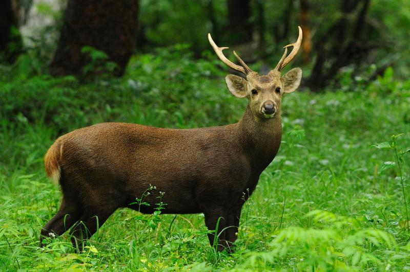

Published by the Nordic Board of Wildlife Research in 2016, David M. Forsyth et al looked at the relationship between hog deer age and eye lens mass. Determining age, postmortem, is often a critical analysis of wildlife condition. Often molar erosion has been the primary method of age determine for large ruminant mammals, but it is an imprecise measure. Based in Australia, young hog deer were tagged and harvested between 4 months and 15 years later. Lenses were collected from both eyeballs and determined that there was no significant difference lens mass between two individual eyes of the same deer. 5 models were used to replicate the non-linear function expressed between deer age and lens mass. The logistic function appeared to represent the data best. 

After re-reading the paper multiple times I have determined that the Lord Model, that I was asked to recreate, is based on Bayesian principals that exceeded my current statistical abilities in R. I proceeded with my model in the manner expressed to me given the logistic model and hope its representation is adequate to the figures of the original paper. 

Provided in a txt. file were hog deer age, lens mass, and tag number. From the original text I will be attempting to recreate Table 1, Table 2, and Figure 1. 


## Packages Needed
```{r eval=FALSE}
library(lme4)
library(car)
library(optimx)
library(deSolve)
library(ggplot2)
library(data.table)
```
## Importing the txt. file into R
```{r eval=FALSE}
   setwd("C:/Users/clint/Desktop/AN597_Project/Individule/Data/doi_10.5061_dryad.0r31r__v1")
df <- read.table("hog.txt", header = TRUE)
head(df)
```

```{r eval=FALSE}
summary(df) #Just for my informational purposes
```
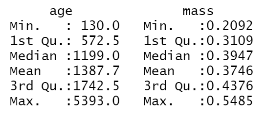

```{r eval=FALSE}
plot(df) #A first look at the provided data plot
```
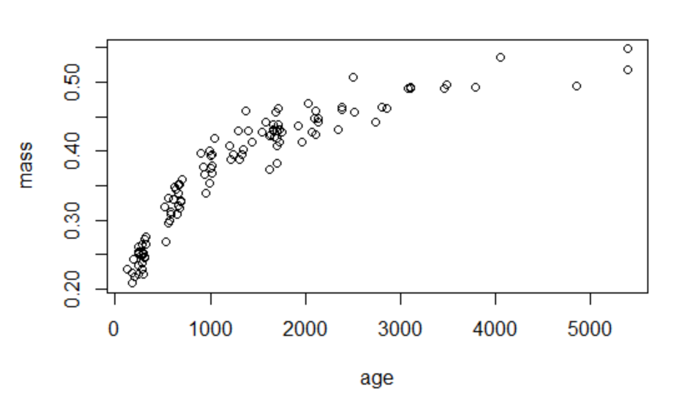
## Non-linear least squares attempt:

We had never gone over non-linear models in class before so I felt that it was important for me to get a beter grasp of how R processes this information. Below I follow a series of steps to create a basic non-liner least squares regression that follows my data.

```{r eval=FALSE}
mass <- c(df$mass)
age1 <- c(df$age)
age <- age1/365 #Changes age from days to years
m <-nls(mass ~ a*age/(b+age))
cor(mass,predict(m)) #This is an indicator of how well the model fits the data. Everythihg I found online indicated that the warning below is normal and nothing to worry about
```

```{r eval=FALSE}
plot(age,mass) 
lines(age,predict(m),lty=2,col="red",lwd=3) #Plot the model agenst the data
```
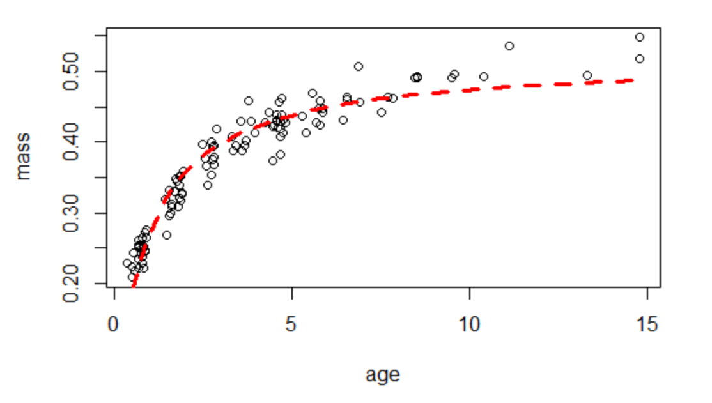


### Determining the rate of growth

Here I attempt to determin the logarithmic rate of growth for the models below
```{r eval=FALSE}
RoG <- (log(max(mass)/min(mass)))/(max(age)) #Equation for logarithmic growth
```
```{r eval=FALSE}
a_start<- 0.2 #param a is the y value when "x=0"
b_start<- 0.06523683 #b is the growth rate
k <-nls(mass~a*exp(-b*age),start=list(a=a_start,b=b_start))
cor(mass,predict(k)) #The predicted outcome is not as good as the previos attempt. For the nls attempt prior the value = 0.96. Here the value = 0.81
```

```{r eval=FALSE}
plot(age,mass)
lines(age,predict(k),col="red",lty=2,lwd=3) #Something in this model did not line up correctly. As you can see from the figure below, my line does not trend with the data
```
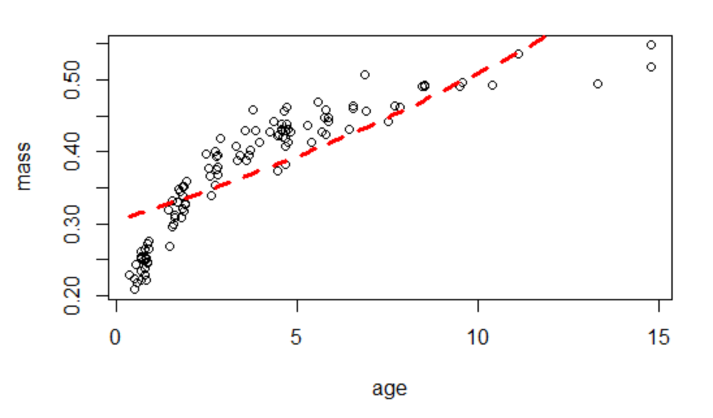

## Starting Models

From the original paper I attempted to recreate 3 of the 5 statistical models. I was provided contextual code for the Logistic and Gompertz models by Prof. Schmitt to recreate the Lords model. As I mentioned in my opening statment, the lord model in the paper is based on baysian concenpts that exceed my current statistical abilities R. I attempt to recreate the equation found in Table 2. for the Lords model through the same operations viewed from the Logistic and Gompertz models. 

### Starting Variables
```{r eval=FALSE}
t1 <- max(mass) #starting  value for "gamma", parameter for the asymptote of growth
new <- lm(logit(mass/t1)~age,data=df)
t2 <- new$coef[1] #starting value for "beta", parameter of the midpoint of the growth curve
t3 <- new$coef[2] #starting value for "alpha", parameter of the rate of growth
```

### Logistic Model:

```{r eval=FALSE}
l <- function(age,gamma,alpha,beta) {gamma/(1+exp(-(alpha+beta*age)))}
model.logistic <- nls(mass ~ g(age,gamma,alpha,beta), data=df, start=list(gamma=t1,alpha=t2,beta=t3))

summary(model.logistic) #Parameter gamma estimate and Std. error are the same as the values from the original paper. Parameters alpha and beta do not share the same values. 
```
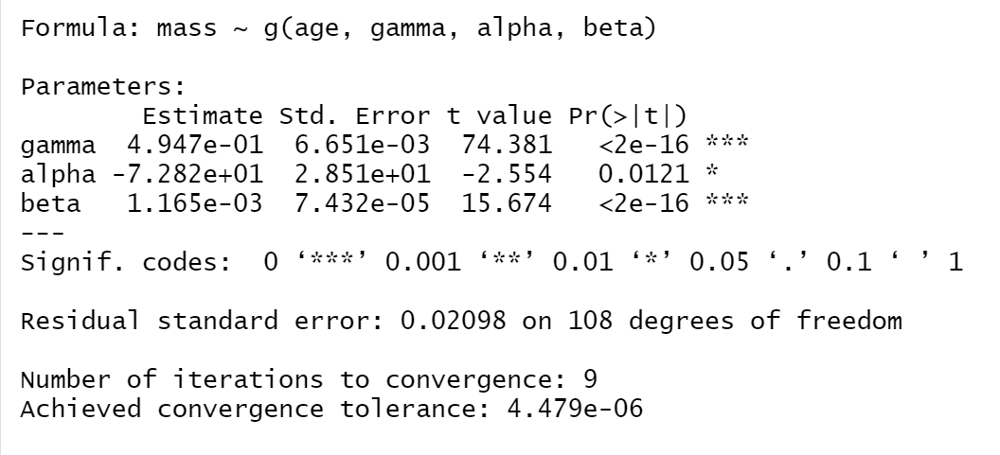

This is my first attempt at plotting the figure similar to the original paper.

```{r eval=FALSE, fig.width= 4,fig.height=4}
t <- ggplot(data = df, aes(age,mass)) +
  geom_smooth(model = model.logistic, se = TRUE, color = "red", size = 0.5, linetype = 2, alpha = 0.15)  +
  geom_point(aes(age,mass), size = 1, shape = 21, stroke = 1) +
  theme_test() +
  scale_y_continuous(lim = c(0.20, 0.56), breaks = c(0.24,0.28, 0.32, 0.36, 0.40, 0.44, 0.48, 0.52, 0.56))
  #scale_x_continuous(lim = c(0, 15), breaks = c(1, 2, 3, 4, 5, 6, 7, 8, 9, 10, 11, 12, 13, 14, 15)) # This section is removed becasue it wouldn't run. I don't know why it wouldn't let me alter the x scale the same as the y scale.
t <- t + xlab("Age (years)") + ylab("Lens mass (g)") #
t
```
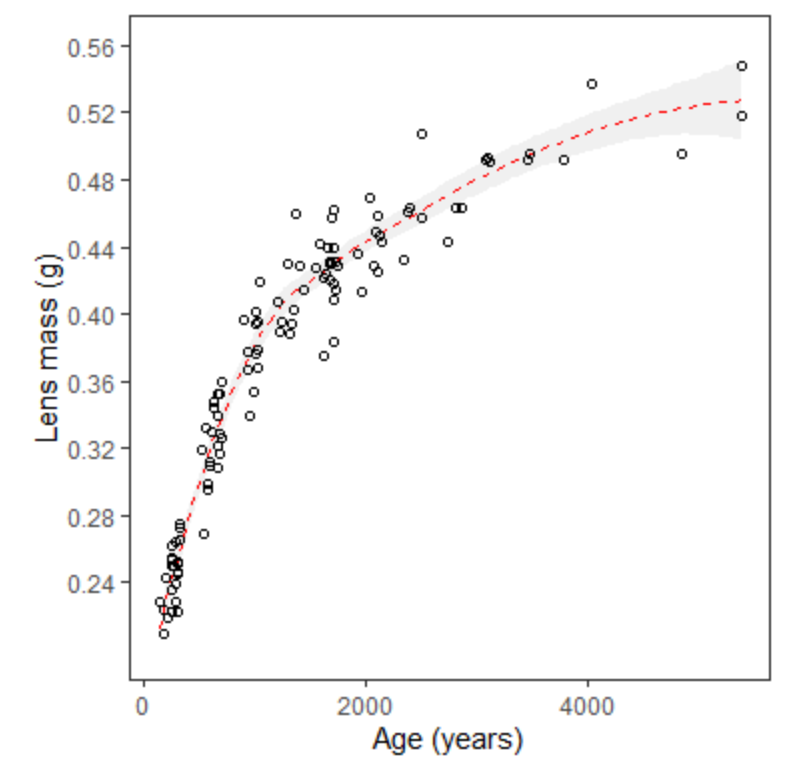

### More attempts at embeding the logistic model into the figures properly. 

```{r eval=FALSE, fig.width= 4,fig.height=4}
plot(age,mass)
lines(age,predict(model.logistic),col="red",lty=2,lwd=1)
```
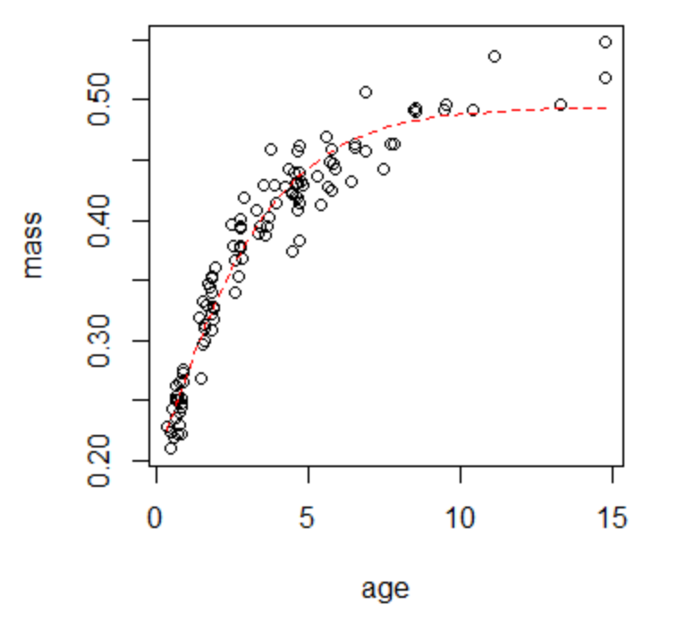

```{r eval=FALSE, fig.width= 4,fig.height=4}
plot(mass ~ age) #this doesnt work, tried to figure out the confidence interval
lines(age, fitted(model.logistic), lty = 2, col = "red", lwd = 2) #I looked into defining the confidence interval but I was unsucessful. The below code is the reminants of that. 

#lines(age, model.logistic(1:100, conf[1, 1], conf[2, 1], conf[3, 1], conf[4, 1]), lty = 2, 
    #lwd = 1, col = "blue")
#lines(age, model.logistic(1:100, conf[1, 2], conf[2, 2], conf[3, 2], conf[4, 2]), lty = 2, 
    #lwd = 1, col = "blue")
```
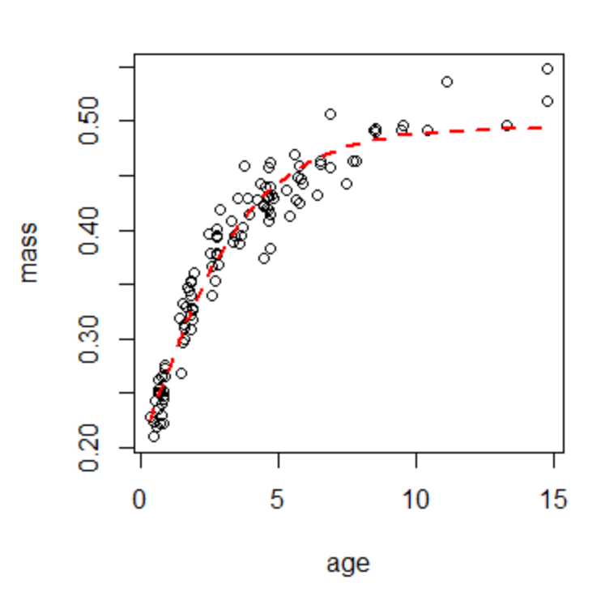

### Gompertz Modle: 

The equation is the only differnce between the Logistic and Gomperts models below. 

```{r eval=FALSE}
g <- function(age,gamma,alpha,beta){gamma*exp(-exp(-(beta*(age-alpha))))}
model.gompertz <- nls(mass ~ gamma*exp(-exp(-(beta*(age-alpha)))), data=df, start=list(gamma=t1,alpha=t2,beta=t3))

summary(model.gompertz)
```
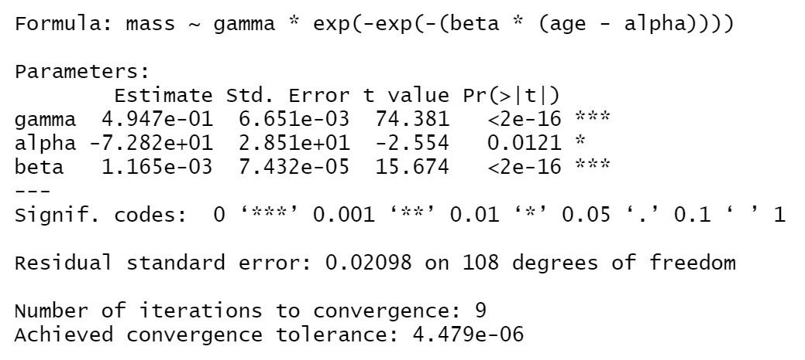

```{r eval=FALSE, fig.width= 4,fig.height=4}
plot(age,mass)
lines(age, predict(model.gompertz),col="red",lty=2,lwd=1)
```
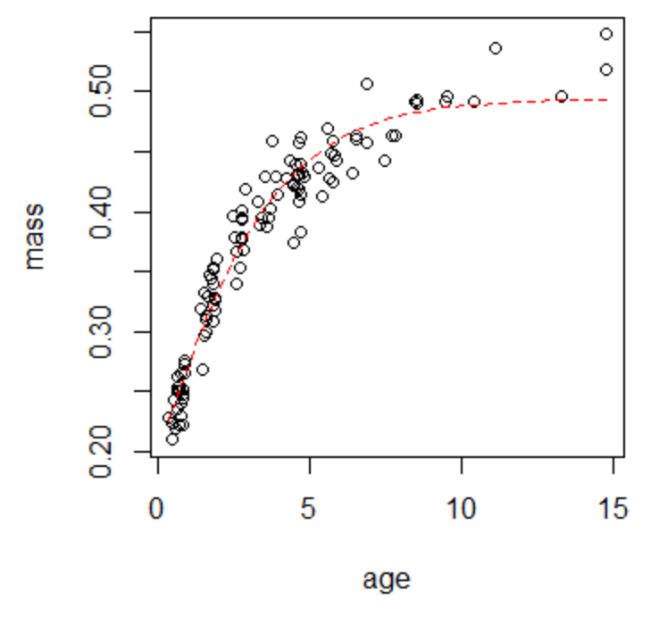

```{r eval=FALSE, fig.width= 4,fig.height=4}
p <- ggplot(data = df, aes(age,mass)) +
  geom_smooth(model = model.gompertz, color = "red", size = 0.5, linetype = 2, alpha = 0.15)  +
  geom_point(aes(age,mass), size = 1, shape = 21, stroke = 1) +
  theme_test() +
  scale_y_continuous(lim = c(0.20, 0.56), breaks = c(0.24,0.28, 0.32, 0.36, 0.40, 0.44, 0.48, 0.52, 0.56))
  #scale_x_continuous(lim = c(0, 15), breaks = c(1, 2, 3, 4, 5, 6, 7, 8, 9, 10, 11, 12, 13, 14, 15))
p <- p + xlab("Age (years)") + ylab("Lens mass (g)") 
p
```
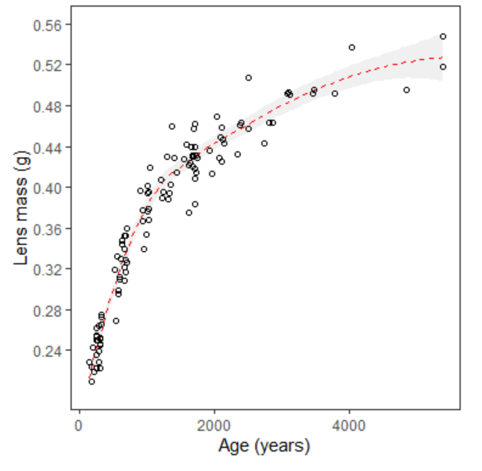

### Lord Model: Something isn't right because every figure looks the same
```{r eval=FALSE}
L <- function(age,gamma,beta,alpha){gamma*exp(-beta/(x + alpha))}
lord.model <- nls(mass ~ L(age,gamma,beta,alpha), data=df, start=list(gamma=t1,beta=t3,alpha=)
summary(lord.model)
```

```{r eval=FALSE, fig.width= 4,fig.height=4}
plot(age,mass)
lines(age,predict(lord.model),col="red",lty=2,lwd=1)
```

```{r eval=FALSE, fig.width= 4,fig.height=4}
p <- ggplot(data = df, aes(age,mass)) +
  geom_smooth(model = lord.model, color = "red", size = 0.5, linetype = 2, alpha = 0.15)  +
  geom_point(aes(age,mass), size = 1, shape = 21, stroke = 1) +
  theme_test() +
  scale_y_continuous(lim = c(0.20, 0.56), breaks = c(0.24,0.28, 0.32, 0.36, 0.40, 0.44, 0.48, 0.52, 0.56))
  #scale_x_continuous(lim = c(0, 15), breaks = c(1, 2, 3, 4, 5, 6, 7, 8, 9, 10, 11, 12, 13, 14, 15))
p <- p + xlab("Age (years)") + ylab("Lens mass (g)") 
p
```

## Tables

### Table 1.
```{r eval=FALSE}
Age_class_years <- c(0:10,"Total")
n <- c(23,20,12,10,19,9,5,3,3,2,5,11)
T1.df <- data.frame(Age_class_years,n)
T1.df
```

### Table 3.

Values Pulled from summary statistics for each model above. I previosuly did not change the greek terminology from (theta1,theta2,theta3) to (gamma,alpha,beta) to simplify my anlaysis above. I am now transforming those values to  correctly allign with the original table. 
```{r}
Model_name <- c("Lord","Lord stderr","Logistic","Logistic stderr","Gompertz","Gompertz stderr")
gamma <- c(0.259,(0.003),0.488,(0.006),0.495,(0.007)) #Values previoulsy allign with theta1
alpha <- c("NA","NA",-0.303,(0.0431),-72.8,(28.5)) #Values Previously allign with theta2
beta <- c(190,(8.47),0.00145,(0.0000888),0.00117,(0.0000743)) #Values previosuly allign with theta3
T3.df <- data.frame(Model_name,gamma,alpha,beta)
T3.df

```


